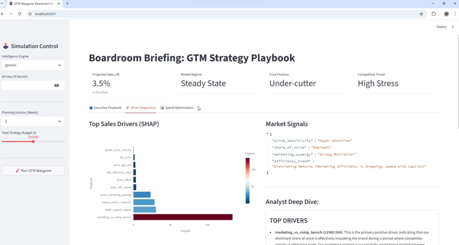
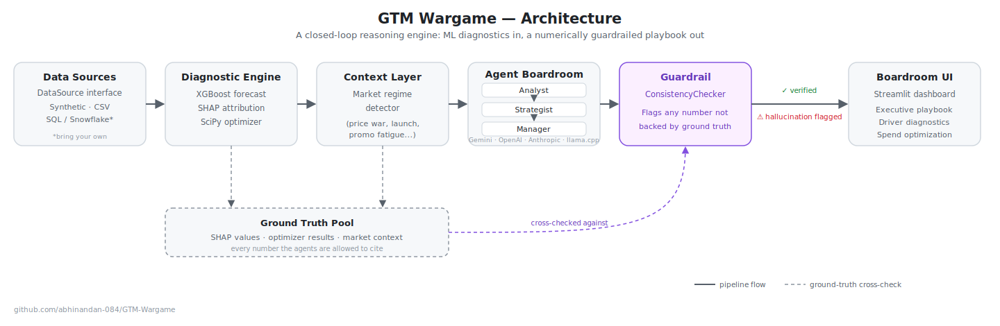

# 🤖 GTM Wargame: The Agentic GTM Strategy Simulator


[]([YOUR-ARTICLE-URL](https://medium.com/p/0db77efb0644))

## The problem this repo actually solves

Ask an LLM to write an executive strategy memo from your ML outputs, and sooner or later it will invent a number. It'll say "47% lift" when your optimizer said 12%. In a boardroom, one hallucinated metric is enough to burn the credibility of the whole dashboard - so most teams either keep a human in the loop for every number, or don't ship the LLM layer at all.

**GTM Wargame ships it anyway, by treating "don't hallucinate" as a system property, not a prompting trick.** Every number the agents are allowed to cite is drawn from a single **Ground Truth Pool** - the SHAP values, the optimizer output, the market context - and before anything reaches the UI, a **`ConsistencyChecker`** regex-parses the agent's response and cross-references every number it wrote against that pool. Percentage-vs-fraction scaling, rounding, sign - all handled. If a number doesn't match anything in the pool, it's flagged as a hallucination and the UI shows a warning instead of pretending the output is trustworthy.

Everything else in the repo - the XGBoost forecaster, the SHAP attribution, the SciPy budget optimizer, the three-agent Analyst/Strategist/Manager chain - exists to feed that pool and to give the guardrail something worth checking.

## What it does, concretely

It simulates weekly sales, pricing, and marketing spend for a smartphone OEM, trains an XGBoost model to forecast sales and attribute drivers via SHAP, runs a `scipy.optimize.differential_evolution` search to find the sales-maximizing price/spend allocation under a budget constraint. All of that then goes to a three-agent LangChain "boardroom" (Analyst → Strategist → Manager) that turns it into an executive playbook, guardrailed by the `ConsistencyChecker` described above.

## Demo

[](https://www.youtube.com/watch?v=S_teSaizhiY)

## Architecture



| Layer | Module | Role |
|---|---|---|
| Data Sources | `gtm_boardroom/data/source.py` | `DataSource` interface behind `SyntheticDataSource` and `CSVDataSource` - the seam a SQL/Snowflake connector would plug into |
| Diagnostic Engine | `gtm_boardroom/diagnostics/driver_engine.py` | XGBoost forecast, SHAP attribution, SciPy budget optimizer |
| Context Layer | `gtm_boardroom/diagnostics/driver_engine.py` (`get_market_context`) | Heuristics that turn raw metrics into a market regime (price war, launch window, promotion fatigue...) |
| Agent Boardroom | `gtm_boardroom/agents/gtm_agents.py` | Analyst → Strategist → Manager, running on whichever `LLMProvider` is configured |
| **Guardrail** | `gtm_boardroom/guardrails/consistency_checker.py` | Cross-checks every number the agents write against the Ground Truth Pool |
| UI | `gtm_boardroom/app/boardroom_app.py` | Streamlit boardroom dashboard, surfaces the guardrail's verdict alongside the playbook |

## The Guardrail Pattern

This is the part worth stealing for your own LLM-over-ML-outputs project.

1. Build a Ground Truth Pool. Every number the agents are permitted to reference - SHAP values, market context signals, optimizer results - gets flattened into one pool of floats (`ConsistencyChecker._flatten_data`).
2. Let the agents write freely. The Analyst/Strategist/Manager prompts are unconstrained prose with chain-of-thought reasoning - no rigid output schema to fight against.
3. Parse the output after the fact. `ConsistencyChecker.validate_response` regex-extracts every number the LLM wrote and checks it against the pool, with tolerance for rounding and percentage/fraction scaling (an agent writing "12" for a ground-truth value of `0.12`, or vice versa, is still considered a match).
4. Surface the verdict instead of silently correcting it. If a number can't be matched to anything in the pool, it's surfaced as a hallucination in the UI - the boardroom sees the flag, not a quietly "fixed" number.

```python
result = ConsistencyChecker.validate_response(
    text=manager_summary,
    shap_info=shap_values,
    market_context=market_context,
    opt_results=optimizer_output,
)
# {"is_valid": False, "hallucinated_values": [47.0], "error_msg": "..."}
```

If the Manager agent claims a **"47% lift"** but the optimizer actually forecast 12%, this is exactly what gets caught.

## Measured Results

> 📊 **Full write-up:** [Why My LLM Guardrail Flagged the Right Answers (And Why I Refused to Fix It)](https://medium.com/p/0db77efb0644) - published in Towards AI, covering the complete methodology, the flag-by-flag audit, and why the false positives stayed in.

Two experiments in `benchmark/` put actual numbers behind the guardrail:

- **[Checker precision & recall](benchmark/results/eval_checker_report.md)** (Experiment B, deterministic, runs in CI): the `ConsistencyChecker` scored **precision 1.000, recall 1.000, false-positive rate 0.000** across 75 labelled cases / 258 numbers built on authentic pipeline artifacts. All 43 injected fabrications were caught, with zero false flags on percentage-scaling, rounding, negative-sign, `$1,234`-formatting, and k-notation (`176k`) trap bait. Every injected value is programmatically verified to be unmatchable against its ground-truth pool at fixture-build time, so recall can't be inflated by fakes that accidentally match.
- **[LLM fabrication rates](benchmark/results/experiment_a_report.md)** (Experiment A, real API calls, run locally, never in CI): how often real models write a number that isn't in the ground truth, with the guardrail observing. A flag is only an *upper bound* on fabrication, so every flag from the 30 paired seeds (identical scenarios per model, analyst + strategist nodes scored) was audited against its deterministically rebuilt pool and classified - the audit lives in the same report. **Gemini fabricated 0 of 537 numbers (0/30 runs)**: its only 3 flags were correct derived percentages the pool doesn't store (guardrail false positives by design - deriving new true values is outside the checker's contract). **Local llama.cpp (Llama 3.1 8B Q4) fabricated 10 of 138 numbers** (7.2%, 95% CI [4.0%, 12.8%]; 4/30 runs) - every one of its flags survived the audit as genuine. The local model's cleanly separated per-number rate shows why the guardrail is load-bearing in local/private deployments - and the frontier model's all-false-positive flags show why guardrail output gets audited before it becomes a claim. Every flagged transcript is committed under [`benchmark/results/examples/`](benchmark/results/examples/).

Both are reproducible: `uv run python benchmark/eval_checker.py --rebuild-fixtures` rebuilds and rescores Experiment B offline (no API keys), and `uv run python benchmark/run.py --dry-run` exercises the Experiment A pipeline with zero API calls.

One honest caveat, stated in both reports: this measures **numerical grounding against a known pool** - whether a cited number exists in the ground truth - not semantic correctness of the argument the number appears in.

## Data & Privacy

Your raw sales, spend, and pricing data never leaves your machine.

The LLM layer only ever receives **derived signals** - SHAP values, market-regime labels, optimizer results - never the underlying dataframe. `GTMBrain`'s three node methods (`get_analyst_node`, `get_strategist_node`, `get_gtm_manager_node`) take dictionaries of numbers and labels as arguments; nothing upstream of them ever hands over the raw historical records.

What that means depending on which provider you configure:
- **Gemini / OpenAI / Anthropic**: only the aggregated statistics above are sent to that provider's API - never a row of your actual sales/spend history.
- **llama.cpp**: nothing leaves the machine at all - inference runs in-process against a local `.gguf` model file.

This is why `SyntheticDataSource`, `CSVDataSource`, and any future SQL/Snowflake-backed `DataSource` can point at real internal data without changing the privacy story - the boundary is enforced structurally at the `GTMBrain` interface, not by convention.

## Key Technical Features

**1. Programmatic Context Detection**

`GTM_DriverEngine.get_market_context()` translates raw signals into a strategic regime:
- **Price Sensitivity** - "Hyper-sensitive" vs. "Brand-driven" pricing regimes
- **Share of Voice (SOV)** - marketing dominance relative to competitor launch cycles
- **Promotion Fatigue** - diminishing returns on retail rebates

**2. Multi-Agent Boardroom Logic**

Chain-of-thought reasoning across three personas: **Data Analyst** (maps SHAP values to market signals), **Growth Strategist** (critiques the optimizer's spend allocation against efficiency trends), **GTM Manager** (synthesizes the final wargame playbook with contingency plans).

**3. Multi-Provider LLM Support**

An `LLMProvider` abstraction (`gtm_boardroom/agents/providers.py`) normalizes response handling across providers, so `GTMBrain` never branches on which one is active. Supported today: **Gemini**, **OpenAI**, **Anthropic**, plus **llama.cpp** for fully local/offline use via [`llama-cpp-python`](https://github.com/abetlen/llama-cpp-python) bindings against a `.gguf` model file on disk, with no separate server process. The Streamlit sidebar auto-detects which cloud providers are usable by checking which of `GOOGLE_API_KEY` / `OPENAI_API_KEY` / `ANTHROPIC_API_KEY` are set - bring whichever keys you have. `llamacpp` is always listed, since it needs a model path, not a key.

**4. Pluggable Data Sources**

`GTM_DriverEngine` depends only on the `DataSource` interface, not on how the data was produced. `SyntheticDataSource` wraps the built-in market simulator; `CSVDataSource` loads a pre-generated dataset (the committed `data/simulated_sales_data_rank_3.csv` is a working example). A SQL/Snowflake-backed `DataSource` slots in the same way, with no changes to the diagnostic engine, agents, or guardrail.

## Project Structure

```text
src/gtm_boardroom/
├── app/
│   ├── boardroom_app.py       # Streamlit UI: the Boardroom Dashboard
│   └── cli.py                 # `gtm-boardroom` console script entry point
├── agents/
│   ├── gtm_agents.py          # GTMBrain: Analyst -> Strategist -> Manager prompts
│   └── providers.py           # LLMProvider abstraction (Gemini/OpenAI/Anthropic/llama.cpp)
├── data/
│   ├── generator.py           # GTM_DataGenerator: synthetic market data factory
│   ├── source.py              # DataSource interface (SyntheticDataSource, CSVDataSource)
│   ├── schemas.py             # Pydantic config schemas
│   ├── config.py              # Loads simulation_config.yaml
│   └── simulation_config.yaml
├── diagnostics/
│   └── driver_engine.py       # GTM_DriverEngine: XGBoost + SHAP + SciPy optimizer
└── guardrails/
    └── consistency_checker.py # ConsistencyChecker: the hallucination guardrail

benchmark/
├── eval_checker.py            # Experiment B: checker precision/recall harness
├── run.py                     # Experiment A: LLM fabrication-rate driver
├── fixtures/                  # labelled cases (committed, reproducible offline)
└── results/                   # reports, per-run records, flagged transcripts

tests/                         # pytest suite, runs in CI on every push/PR
docs/architecture.svg          # the diagram above
data/simulated_sales_data_rank_3.csv   # sample historical CSV (CSVDataSource demo)
notebooks/marketing_physics.ipynb      # exploratory notebook on the underlying market physics
```

## Installation & Setup

**1. Clone and install**
```bash
git clone https://github.com/abhinandan-084/GTM-Wargame.git
cd GTM-Wargame
uv sync --group dev
```

**2. Configure whichever LLM provider(s) you have keys for**

Create a `.env` file in the repo root (already gitignored):
```text
GOOGLE_API_KEY=...      # enables Gemini
OPENAI_API_KEY=...      # enables OpenAI
ANTHROPIC_API_KEY=...   # enables Anthropic
```
Only cloud providers with a key present show up in the sidebar. `llamacpp` is always listed - it runs fully locally via `llama-cpp-python`, no key required.

**For local inference (llamacpp)**, download a `.gguf` model and either rely on the default path or point at your own:
```text
LLAMACPP_MODEL_PATH=/path/to/your-model.gguf
```
If unset, it falls back to `~/llama.cpp/models/Meta-Llama-3.1-8B-Instruct-Q4_K_M.gguf`. The model loads in-process on first use - the first call after starting the app will be slow while it loads into memory.

**3. Run it**
```bash
uv run gtm-boardroom
# or equivalently:
uv run streamlit run src/gtm_boardroom/app/boardroom_app.py
```

**4. Run the tests**
```bash
uv run pytest
```

## Methodology

**1. Forecasting**: XGBoost Regressor (`n_estimators=200, max_depth=5`) trained on rolling historical features.

**2. Optimization**: `scipy.optimize.differential_evolution` maximizes sales lift across three channels (Search, Social, Retail) under a fixed budget constraint.

**3. Attribution**: Tree-based SHAP values explain the most recent data point, giving the agents the "why" behind sales variances.

## Key Boardroom Metrics

- **Projected Sales Lift** - delta between the optimized proposal and historical baseline
- **Marketing Synergy Score** - whether adstock is amplifying or disconnected from price-gap impact
- **Promotion Fatigue Index** - diminishing returns in rebate strategies

## Related work

[local_llm_benchmarks](https://github.com/abhinandan-084/local_llm_benchmarks) - my benchmarks on squeezing throughput out of local LLMs on constrained hardware (the "abstraction tax"): asymmetric thread tuning, KV-cache quantization, PCIe limits. Companion to this repo's hallucination/grounding work.

## Roadmap

- [x] Pluggable `DataSource` interface (synthetic, CSV; SQL/Snowflake next)
- [x] Multi-provider LLM support (Gemini, OpenAI, Anthropic)
- [x] Native `llama.cpp` support for fully local/offline inference
- [ ] A 'CFO Agent' persona for margin-impact validation on top of the existing boardroom

Tracked as GitHub issues on this repo if you want to follow along or contribute.
